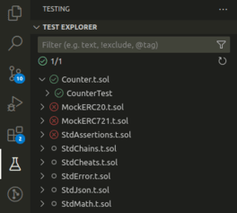

<figure align="center">
  
<strong>Foundry/Forge</strong>

  
</figure>

<figure align="center">
  
For this extension, we use foundry/forge for the following features: unit tests, compiler, references, definitions and the formatter.

</figure>

<figure align="center">
  
</figure>
