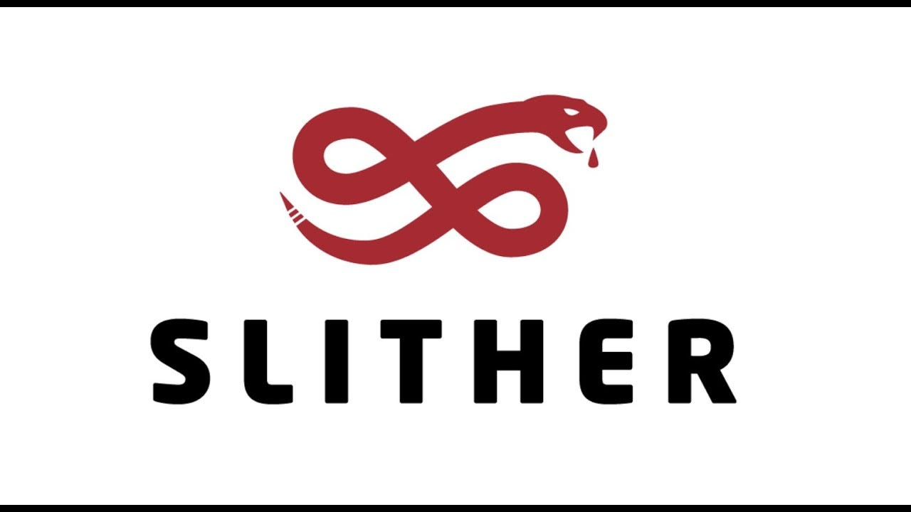

<figure align="center">
  
</figure>

<figure align="left">
  
Here is the <a href="https://crytic.github.io/slither/slither.html">documentation</a> of Slither and here is the <a href="https://github.com/crytic/slither">GitHub repository</a>. 

  Slither is a static analysis framework for smart contracts written in Solidity or Vyper. With Slither, you can run a series of vulnerability detectors on your Solidity contracts to flag potentially risky code and receive suggestions for corrections.

</figure>

<figure align="center">
  
</figure>
