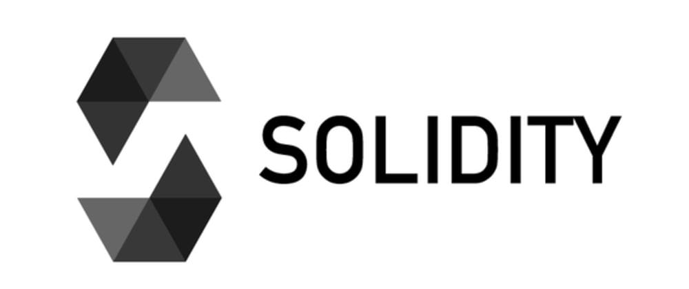
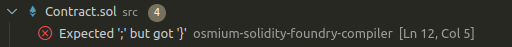

<figure align="center">
  
</figure>

<figure align="left">
  
Here is the <a href="https://docs.soliditylang.org/en/latest/using-the-compiler.html">documentation</a> of Solidity compiler</a>. 

  The Solidity Compiler is a tool that translates Solidity code into bytecode executable on the Ethereum Virtual Machine (EVM). Written in Go, it’s essential for smart contract development, transforming high-level Solidity code into a format understood by the Ethereum blockchain.

</figure>

<figure align="center">
  
</figure>
